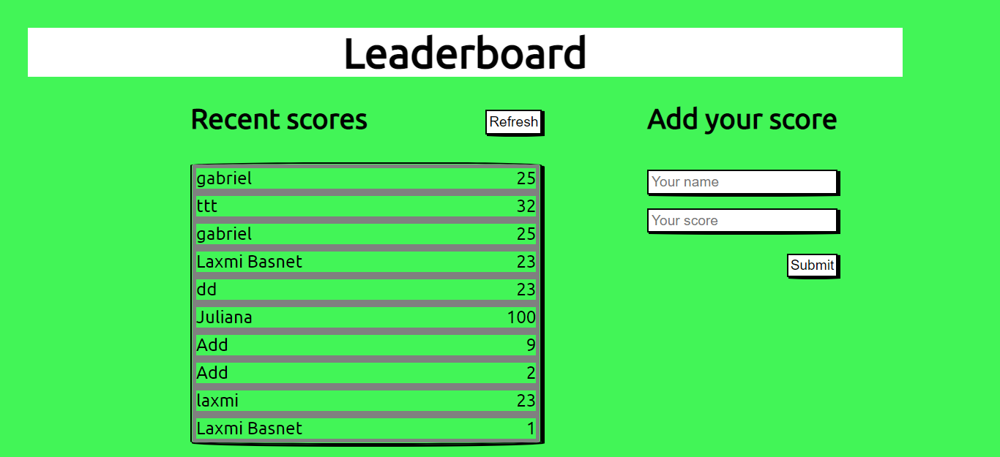

# Leaderboard

> This is the displaying scores submitted by different players. It also allows users to add their score. The main goal of this project was to be able to deal with API and play with promises and async/await. For best practices I have implemented Linter,GitFlow and professional documentation. 

## Built With

- HTML, CSS, js
- Linters, Markdown
- GitFlow 

## Getting Started

To get a local copy up and running follow these simple example steps.

1) Enter `git@github.com:basnetlaxmi/leaderboard.git` into terminal

2) Run cd leaderboard

3) Run `npm install && npm start`

4) If your browser doesn't open automatically, open it manually and type http://localhost:8080/ in the URL bar.

### Prerequisites

- Code editor

- Git and Github

## Author

👤 **Laxmi Basnet**

- GitHub: [@basnetlaxmi](https://github.com/basnetlaxmi)
- LinkedIn: [LinkedIn](https://np.linkedin.com/in/laxmi-basnet-b22403131)

## 🤝 Contributing

Contributions, issues, and feature requests are welcome!

Feel free to check the [issues page](../../issues/).

## Show your support

Give a ⭐️ if you like this project!

## Acknowledgments

- Microverse learning partners
- Microverse

## 📝 License

This project is [MIT](./MIT.md) licensed.
